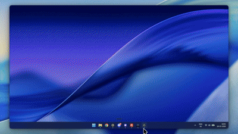
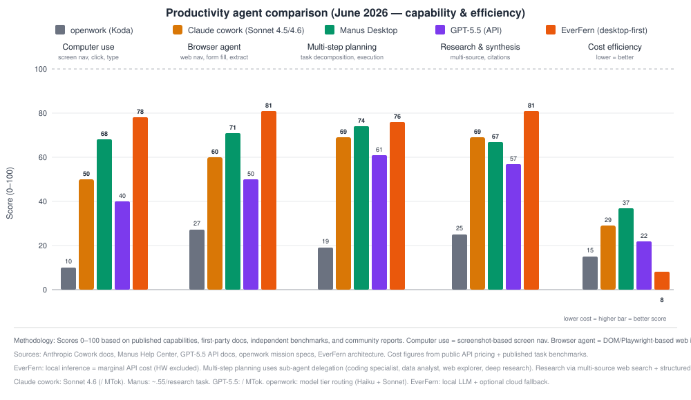

<div align="center">
  
  <h1>EverFern</h1>
  <p>The open-source version of Claude Cowork. Free forever, runs on your machine, no subscription required.</p>
  <p>
    <a href="https://everfern.app">Website</a> •
    <a href="#quick-start">Quick Start</a> •
    <a href="#features">Features</a> •
    <a href="https://discord.gg/wU2DuYSP7s">Discord</a> •
    <a href="https://github.com/CodenRust/Everfern/blob/main/LICENSE">MIT License</a>
  </p>
  
  
  
  <a href="https://discord.gg/wU2DuYSP7s"></a>
</div>

---


> EverFern opening Spotify and playing a song — no scripts, no automation code, just plain English.

---

## What is EverFern?

EverFern is a desktop AI agent that uses your computer the way you would — clicks buttons, navigates apps, fills forms, runs workflows. You describe what you want in plain English. It figures out the steps and does it.

No subscription. No cloud. Nothing leaves your machine.

It's the free, open-source alternative to **Claude Cowork**, **Manus Desktop**, and **OpenWork**.

<br>



<br>

<table width="100%">
<tr>
<td width="50%" valign="top">

### 🌿 EverFern
**Price:** Free forever<br>
**Privacy:** ✅ Runs locally, data stays on your machine<br>
**Open Source:** ✅ MIT Licensed<br>
**AI Providers:** 10+ (Local & Cloud)<br>
**Capabilities:** Full computer use + Navis browser agent + **Self-Evolving Runtime**

</td>
<td width="50%" valign="top">

### 🤖 Claude Cowork
**Price:** $20+/month<br>
**Privacy:** ❌ Cloud processed<br>
**Open Source:** ❌ Closed<br>
**AI Providers:** Anthropic only<br>
**Capabilities:** Full computer use, limited browser

</td>
</tr>
<tr>
<td width="50%" valign="top">

### 🚀 Manus Desktop
**Price:** $200+/month<br>
**Privacy:** ❌ Cloud processed<br>
**Open Source:** ❌ Closed<br>
**AI Providers:** Locked<br>
**Capabilities:** Full computer use + browser agent

</td>
<td width="50%" valign="top">

### 🛠️ OpenWork
**Price:** Free<br>
**Privacy:** ⚠️ Partial local<br>
**Open Source:** ✅ Open Source<br>
**AI Providers:** 3-4 only<br>
**Capabilities:** No computer use, no browser agent

</td>
</tr>
</table>

<br>

---

## Features

<table width="100%">
<tr>
<td width="50%" valign="top">

### 🖥️ Computer Use
Sees your screen, moves the mouse, clicks, types, and navigates any app exactly like a human would. Works with any desktop application — no integrations needed.

</td>
<td width="50%" valign="top">

### 🌐 Navis — Built-in Browser Agent
Navigate websites, fill forms, scrape data, and interact with web apps in plain English. For browser agent we use our own agent called navis [https://github.com/Everfern-AI/Navis-Extension](https://github.com/Everfern-AI/Navis-Extension).

</td>
</tr>
<tr>
<td width="50%" valign="top">

### 🧬 Self-Evolving Tool Synthesis
When existing tools aren't enough, EverFern autonomously **writes, compiles, and registers its own tools at runtime** — protected by a secure **Human-in-the-Loop (HITL)** code approval gate before activation.

</td>
<td width="50%" valign="top">

### 📚 Autonomous Reusable Skills
The agent dynamically builds reusable expert instructions and system prompts, saving them locally as skills to supercharge future workflows and preserve long-term context.

</td>
</tr>
<tr>
<td width="50%" valign="top">

### 📄 Document Processing
Read, analyze, and create PDFs, Word docs, Excel sheets, PowerPoints, and CSVs. Works with your existing files.

</td>
<td width="50%" valign="top">

### 💻 Code Assistant
Write, review, debug, and refactor code with full project context. Works inside your actual editor.

</td>
</tr>
<tr>
<td width="50%" valign="top">

### 🛡️ Self-Healing Loop & Rollback
Failed terminal runs or code edits trigger the **Self-Healing Hook**. EverFern rolls back dirty changes, analyzes errors, and auto-corrects code autonomously — no user intervention needed.

</td>
<td width="50%" valign="top">

### ⚙️ Workflow Builder
Chain actions together, save them, trigger on a schedule. Automate anything you do repeatedly.

</td>
</tr>
<tr>
<td width="50%" valign="top">

### 🔒 Linux VM Execution
Shell commands run in an isolated sandbox so nothing can accidentally break your system.

</td>
<td width="50%" valign="top">

### 🤝 Peer Agent Debate
For complex tasks, multiple specialized agents debate the best solution before anything gets executed. Each agent challenges the others' reasoning, catches blind spots, and votes on the final approach.

</td>
</tr>
<tr>
<td width="50%" valign="top">

### 🧠 Persistent Memory & Smart Compression
EverFern remembers preferences and workflows across sessions. When LLM context limits approach, it semantically compresses history into high-density facts — saving up to 80% in tokens with zero information loss.

</td>
<td width="50%" valign="top">

### 🛠️ 20+ Built-in Tools
Everything EverFern needs is built in:
- **Desktop**: Computer Use, Mouse, Keyboard, App Launcher
- **Browser**: Navis, Web Search, Page Scrape, Form Fill
- **Files**: Read, Write, Edit, Move, Grep, Find
- **Code**: Run Script, Terminal, Diff, Patch, Lint
- **System**: Linux VM Shell, Process Manager, Notifications
- **Synthesis**: Tool Creator, Skill Synthesizer

Plus custom tools via MCP — connect anything.

</td>
</tr>
</table>

## 🔌 Multi-Provider Support

Use local models (Ollama, LMStudio) for complete privacy, or connect to 10+ cloud providers — OpenAI, Anthropic, DeepSeek, Google Gemini, OpenRouter, Nvidia NIM, Mistral, Groq, and more. Switch providers anytime without changing anything else.

---

## Quick Start

**Prerequisites:** Node.js v18+, Windows 10/11 or macOS

```bash
# Clone the repo
git clone https://github.com/CodenRust/Everfern.git
cd Everfern

# Install dependencies
npm install

# Run in development
npm run dev
```

Windows installer available on the releases page.

macOS installer available on the releases page.

### Production Build

```bash
npm run build
npm run make
```

## How It Works

Just tell EverFern what you need:

- "Open Spotify and play my liked songs"
- "Summarize all the PDFs in my Downloads folder into one document"
- "Open VS Code and refactor the auth module to use JWT tokens"
- "Research the top 5 AI coding tools and make a comparison spreadsheet"
- "Find all my photos from last year and organize them by month"

EverFern breaks down the request, plans the steps, shows you its thinking in real time, and executes — pausing for confirmation before anything destructive.

## Architecture

```
┌───────────────────────────┐
                                 │         React UI          │
                                 │   (Next.js App Router)    │
                                 │ ┌───────────────────────┐ │
                                 │ │   Chat Interface &    │ │
                                 │ │   Timeline Progress   │ │
                                 │ └───────────▲───────────┘ │
                                 └─────────────┼─────────────┘
                                               │
                                 ┌─────────────▼─────────────┐
                                 │   Electron Preload IPC    │
                                 │   (window.electronAPI)    │
                                 └─────────────┬─────────────┘
                                               │
 ┌─────────────────────────────────────────────▼──────────────────────────────────────────┐
 │                                   Electron Main Process                                │
 │                                                                                        │
 │   ┌────────────────────────────────────────────────────────────────────────────────┐   │
 │   │                            LangGraph Orchestrator                              │   │
 │   │                                                                                │   │
 │   │     ┌───────────────────────────────┐     ┌─────────────────────────┐          │   │
 │   │     │     Peer Agent Debate         │     │  Memory Compression     │          │   │
 │   │     │  (Triage & Multi-Agent Plan)  │     │   (Semantic Summary)    │          │   │
 │   │     └───────────────┬───────────────┘     └─────────────────────────┘          │   │
 │   │                     │                                                           │   │
 │   │    ┌────────────────┴──────────────┬───────────────────────┐                   │   │
 │   │    ▼                               ▼                       ▼                   │   │
 │   │  ┌────────────┐             ┌────────────┐           ┌────────────┐            │   │
 │   │  │   Coding   │             │    Data    │           │    Web     │            │   │
 │   │  │ Specialist │             │  Analyst   │           │  Explorer  │            │   │
 │   │  └─────┬──────┘             └─────┬──────┘           └─────┬──────┘            │   │
 │   └────────┼─────────────────────────┼───────────────────────┼────────────────────┘   │
 │            │                         │                       │                        │
 │            ▼                         ▼                       ▼                        │
 │   ┌────────────────────────────────────────────────────────────────────────────────┐   │
 │   │                             Tool Gateway Layer                                 │   │
 │   │                                                                                │   │
 │   │  ┌──────────────────────┐  ┌──────────────────────┐  ┌──────────────────────┐  │   │
 │   │  │    Computer Use      │  │   Navis Browser      │  │  Terminal / Pwsh Run │  │   │
 │   │  │ (robotjs/OS Actions) │  │ (Extension Protocol) │  │ (Execution Registry) │  │   │
 │   │  └──────────────────────┘  └──────────────────────┘  └──────────────────────┘  │   │
 │   │  ┌──────────────────────┐  ┌──────────────────────┐  ┌──────────────────────┐  │   │
 │   │  │   Tool Synthesizer   │  │  Skill Synthesizer   │  │    MCP Registry      │  │   │
 │   │  │  (Dynamic TS Loader) │  │ (Markdown Compiler)  │  │ (External MCP Tools) │  │   │
 │   │  └──────────────────────┘  └──────────────────────┘  └──────────────────────┘  │   │
 │   └─────────────────────────────────────┬──────────────────────────────────────────┘   │
 │                                         │                                              │
 │   ┌─────────────────────────────────────▼──────────────────────────────────────────┐   │
 │   │                         Persistence & Database Layer                           │   │
 │   │                                                                                │   │
 │   │  ┌──────────────────────┐  ┌──────────────────────┐  ┌──────────────────────┐  │   │
 │   │  │   SQLite DB (WAL)    │  │  Rollback Snapshots  │  │  Vector DB (SQLite)  │  │   │
 │   │  │ (Messages/State)     │  │  (Failsafe Manager)  │  │  (Semantic Search)   │  │   │
 │   │  └──────────────────────┘  └──────────────────────┘  └──────────────────────┘  │   │
 │   └─────────────────────────────────────┬──────────────────────────────────────────┘   │
 │                                         │                                              │
 │   ┌─────────────────────────────────────▼──────────────────────────────────────────┐   │
 │   │                          AI Client Gateway Registry                            │   │
 │   │                                                                                │   │
 │   │  ┌──────────────────────┐  ┌──────────────────────┐  ┌──────────────────────┐  │   │
 │   │  │    Local Engines     │  │    Cloud Engines     │  │  Specialized VLMs    │  │   │
 │   │  │ Ollama • LM Studio   │  │ Anthropic • OpenAI   │  │ Gemini • Nvidia NIM  │  │   │
 │   │  │                      │  │ DeepSeek • Gemini    │  │ OpenRouter • Groq    │  │   │
 │   │  └──────────────────────┘  └──────────────────────┘  └──────────────────────┘  │   │
 │   └────────────────────────────────────────────────────────────────────────────────┘   │
 └────────────────────────────────────────────────────────────────────────────────────────┘
```

## Privacy & Security

- All data, keys, and history stored in `~/.everfern/store` — never synced anywhere
- API keys encrypted locally
- Shell commands run in an isolated Linux VM
- Full source code available to audit yourself

## Project Structure

```
everfern/
├── src/              # Next.js frontend
│   ├── app/          # Chat interface, settings
│   └── components/   # React components
├── main/             # Electron backend
│   ├── agent/        # Agent orchestration (LangGraph)
│   ├── tools/        # Built-in tools
│   └── acp/          # AI provider clients
├── docs/             # Architecture documentation
└── public/           # Static assets
```

## Contributing

Bug reports, feature requests, and pull requests are all welcome.

- [Issues](#) — report bugs or suggest features
- [Discussions](#) — join community conversations
- [PRs](#) — see [CONTRIBUTING.md](CONTRIBUTING.md) for guidelines

## License

MIT — free for personal and commercial use.

Copyright © 2026 EverFern Community

---

Built with LangGraph, Next.js, Electron, and TypeScript.

Made with ❤️ by the EverFern Community